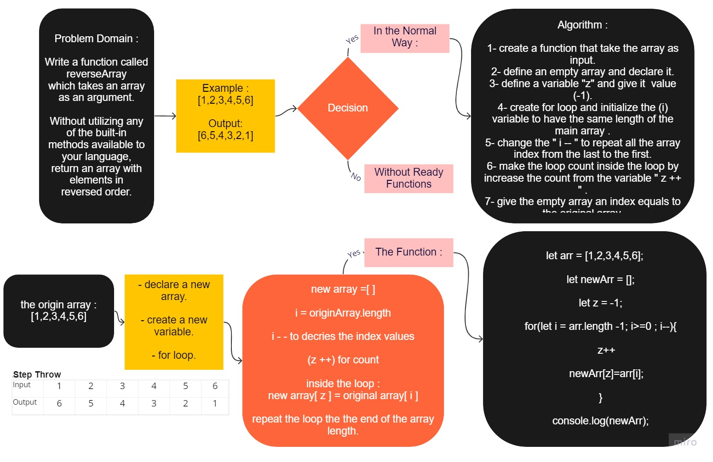

# My Read Me File

# Reverse an Array
<!-- Description of the challenge -->

## Whiteboard Process
<!-- Embedded whiteboard image -->

#### PR

<https://github.com/YaseinBurqan/data-structures-and-algorithms/pull/7>

## Approach & Efficiency
<!-- What approach did you take? Discuss Why. What is the Big O space/time for this approach? -->
