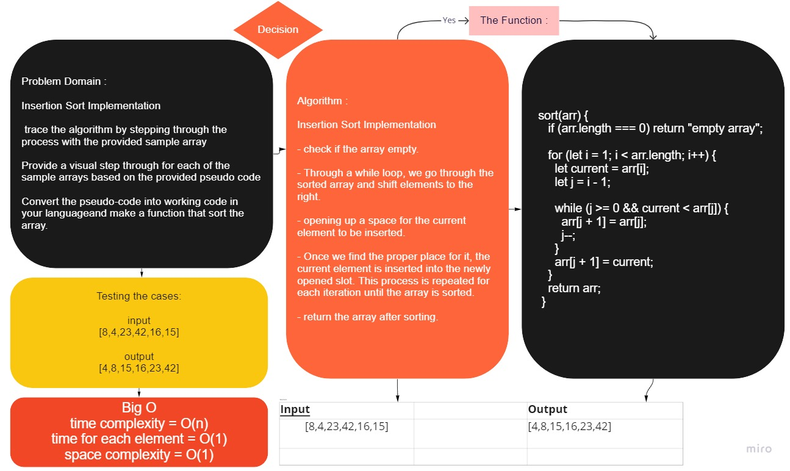
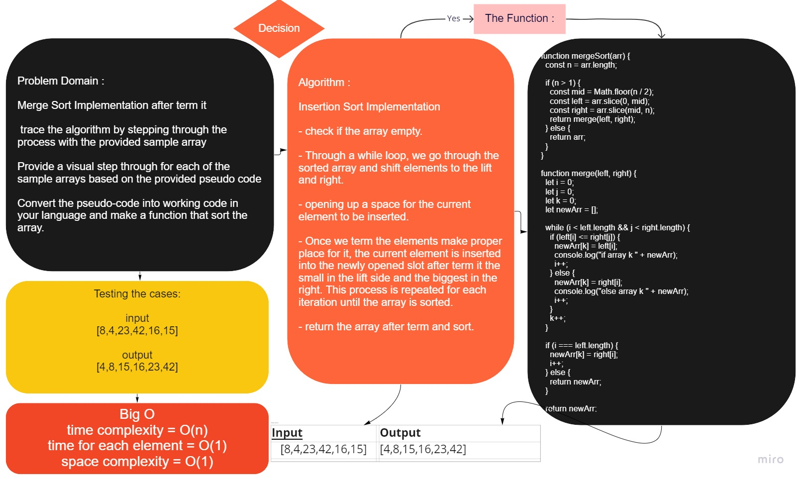
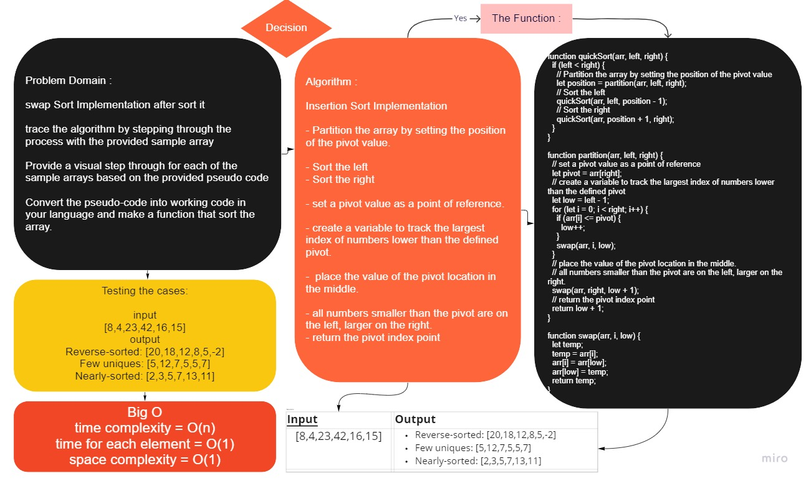

# Insertion and Sort

# Code Challenge : insertionSort

## Challenge
<!-- Description of the challenge -->

Insertion Sort Implementation that sorting the array.

- trace the algorithm by stepping through the process with the provided sample array

- Provide a visual step through for each of the sample arrays based on the provided pseudo code

- Convert the pseudo-code into working code in your languageand make a function that sort the array.

#

## Approach & Efficiency
<!-- What approach did you take? Why? What is the Big O space/time for this approach? -->

    - Understand the problem.

    - Thinking how the results will be.

    - Write the function.

    - Write the code.

    - Making the tests for each file and command.

## API
<!-- Description of each method publicly available to your Linked List -->

    - sort(array): insert an array of any type in a new array for sorting.

### How we can use the API ?

    - To create an empty insertionSort : const = new Insertion()

    - sort() :To insert an array and sort it.

## [The Code](../insertationSort/)

#

#

