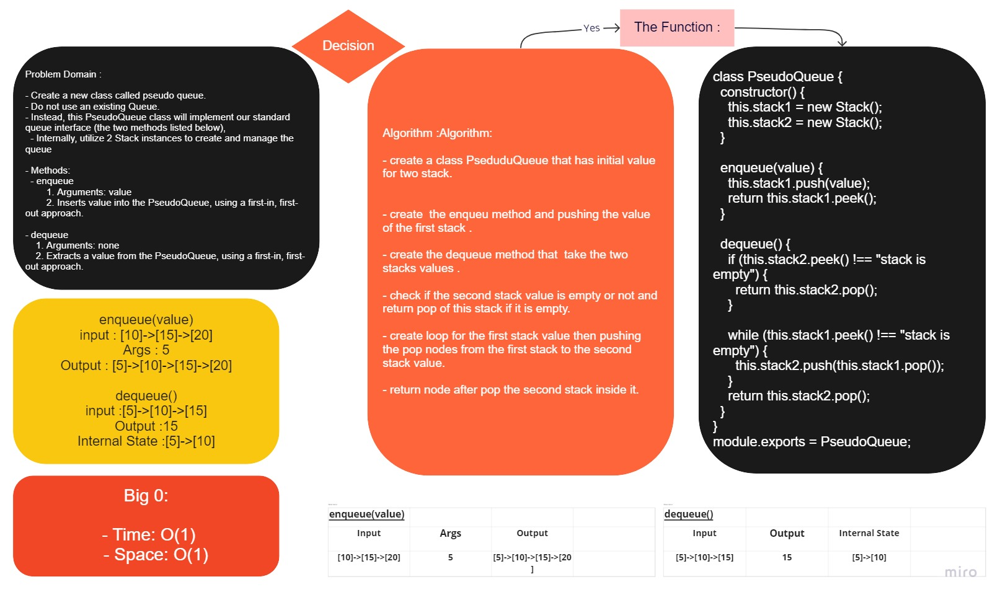

# Stack Queue Pseudo

## Challenge

- Create a new class called pseudo queue.
  - Do not use an existing Queue.
  - Instead, this PseudoQueue class will implement our standard queue interface (the two methods listed below),
  - Internally, utilize 2 Stack instances to create and manage the queue

 

- Methods:
  - enqueue
        1. Arguments: value
        2. Inserts value into the PseudoQueue, using a first-in, first-out approach.

- dequeue
    1. Arguments: none
    2. Extracts a value from the PseudoQueue, using a first-in, first-out approach.

 

    NOTE: The Stack instances have only push, pop, and peek methods. You should use your own Stack implementation. Instantiate these Stack objects in your PseudoQueue constructor.

## Approach & Efficiency

- understand the problem first
- Imagined how the results should be
- write the code
- make the tests

enqueue:

    - Time: O(1)
    - Space: O(1)

dequeue:

    - Time: O(n)
    - Space: O(n)

## API

### Stack

- push(value) : Add a new `node` with that value to the `top` of the stack.

- pop() : Returns the value from `node` from the `top` of the stack.

- peek() : Returns the value of the `node` located at the `top` of the stack.

- isEmpty() : Returns a `boolean` indicating whether or not the `stack` is `empty`.

### Queue

- enqueue(value) : adds a new `node` with that value to the `back` of the queue.

- dequeue() : Removes the `node` from the `front` of the queue.

- peek() : Returns the `value` of the `node` located at the `front` of the queue.

- isEmpty() : Returns a `boolean` indicating whether or not the `queue` is `empty`.

#

## [Code](./stak%26queue/pseudo-queue.js)

## [Test Code](./stak%26queue/__test__/pseudo-queue.test.js)
