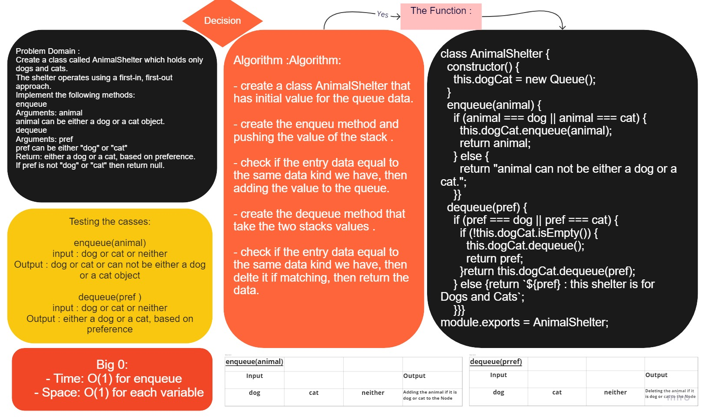

# stack queue animal shelter

Create a Stack and Queue classes with some specs

## Challenge

### Features

Create a class called AnimalShelter which holds only dogs and cats.
The shelter operates using a first-in, first-out approach.
Implement the following methods:
enqueue
Arguments: animal
animal can be either a dog or a cat object.
dequeue
Arguments: pref
pref can be either "dog" or "cat"
Return: either a dog or a cat, based on preference.
If pref is not "dog" or "cat" then return null.

Using a Linked List as the underlying data storage mechanism, implement both a Stack and a Queue

### Queue

- adds a new `node` with that value to the `back` of the queue.
- Removes the `node` from the `front` of the queue.
- Returns the `value` of the `node` located at the `front` of the queue.

#

## Approach & Efficiency

- understand the problem first.
- Imagined how the results should be.
- Write the code.
- Make the tests.

time: O(1)
space: O(1) for each value

#

## API

### Queue

- enqueue(value) : adds a new node with that value to the back of the queue with an O(1) Time performance.

- dequeue() : Removes the node from the front of the queue.

# [Code](../sq_animal_shelter/)

