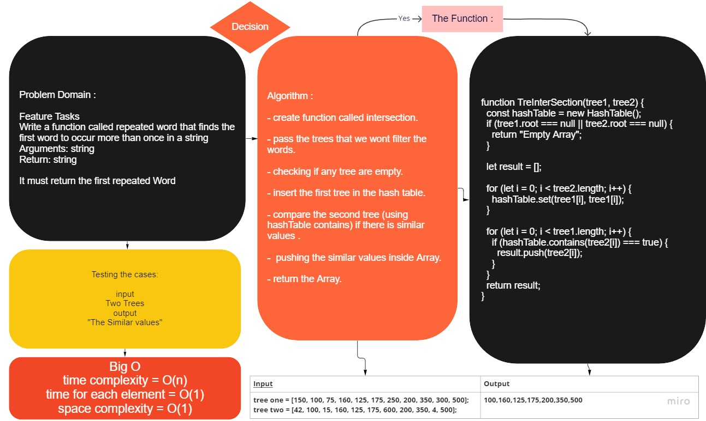

# Intersection

<!-- Short summary or background information -->

# Code Challenge : Tree Intersection

## Challenge
<!-- Description of the challenge -->

Write a function called tree_intersection that takes two binary trees as parameters.
Using your Hashmap implementation as a part of your algorithm, return a set of values found in both trees.

## Approach & Efficiency
<!-- What approach did you take? Why? What is the Big O space/time for this approach? -->

    - Understand the problem.

    - Thinking how the results will be.

    - Write the method on paper after testing.

    - Write the code.

    - Making the tests for each file and command.

## API
<!-- Description of each method publicly available to your Linked List -->

## [Intersection Code](./intersection.js)

