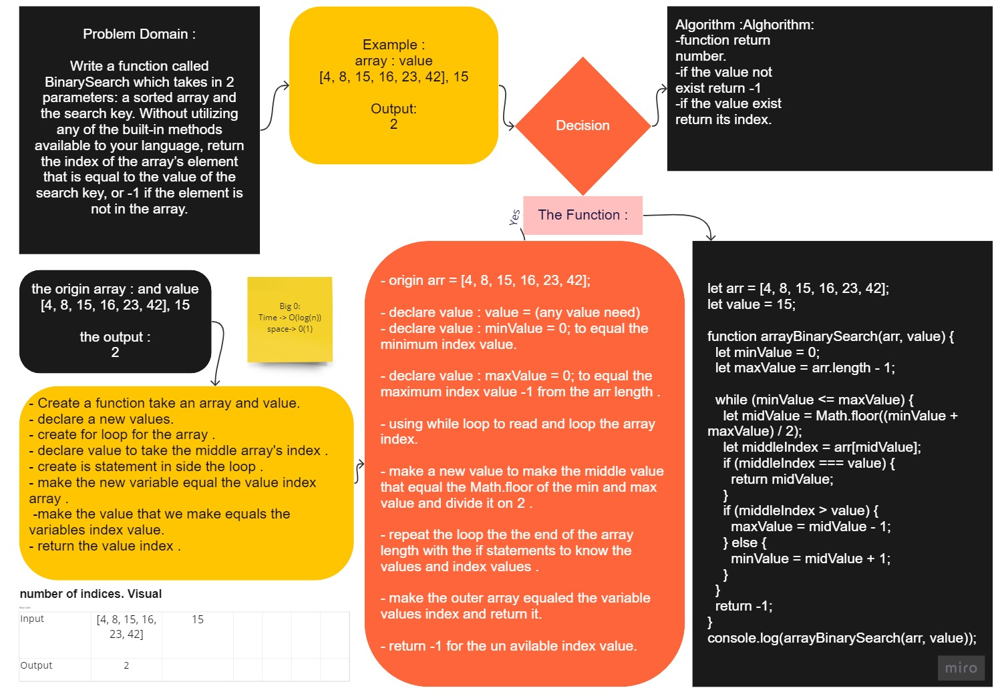

# My Read Me File

# Binary Search of Sorted Array
<!-- Description of the challenge -->
## Feature Tasks

    Write a function called BinarySearch which takes in 2 parameters: a sorted array and the search key. Without utilizing any of the built-in methods available to your language, return the index of the array’s element that is equal to the value of the search key, or -1 if the element is not in the array.

NOTE: The search algorithm used in your function should be a binary search.
Check the Resources section for details

## Whiteboard Process
<!-- Embedded whiteboard image -->

## Approach & Efficiency
<!-- What approach did you take? Discuss Why. What is the Big O space/time for this approach? -->

    Logical thinking & solving step by step

##

    - used loop approach while loop .

    - The Big O time is O(log n) and / Space is O(1) complexity.

[Code](./array-binary-search.js)
