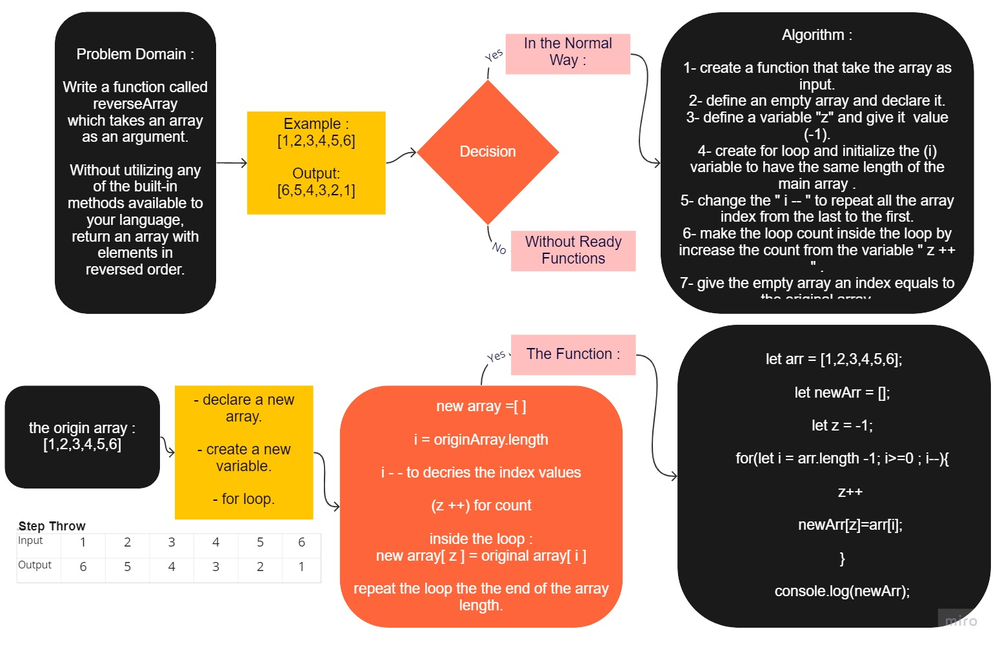

# My Read Me File

# Reverse an Array
<!-- Description of the challenge -->

## Whiteboard Process
<!-- Embedded whiteboard image -->

[array reverse image](./array-reverse.jpg)

#### PR

[PR Page](https://github.com/YaseinBurqan/data-structures-and-algorithms/pull/7)

## Approach & Efficiency
<!-- What approach did you take? Discuss Why. What is the Big O space/time for this approach? -->

## another solution for the Method

    let arr = [1,2,3,4,5,6];
        function reverseArray (arr) {
        var newArr = [];
        for (var i = 0, j = arr.length - 1; i < arr.length; i++, j--) {
            newArr[i] = arr[j];
        }
        return newArr;
    }
    console.log(reverseArray(arr));
