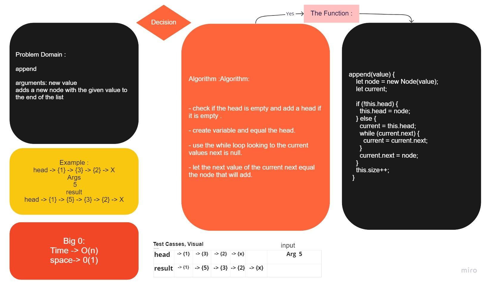
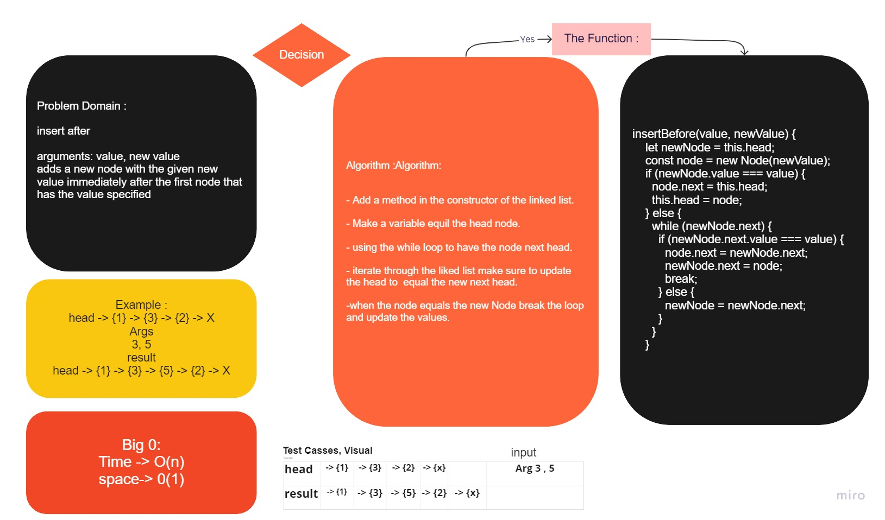

# Read Me File

<!-- <https://www.youtube.com/watch?v=ZBdE8DElQQU> -->
<!-- <https://www.youtube.com/watch?v=gJjPWA8wpQg> -->

# Singly Linked List

<!-- Short summary or background information -->

# Code Challenge : linked-list

## Challenge
<!-- Description of the challenge -->
Create a Node class that has properties for the `value` stored in the Node, and a pointer to the `next Node`

- Create a Linked List `class`

- insert : Adds a new node with that `value` to the head of the list with O(1).

- include : checks if a `value` of the list is/are exist.

- toString : returns all the nodes in a list in a String format

- add tests to the code to test for the following :

##

    1. Can successfully instantiate an empty linked list.

    2. Can properly insert into the linked list.

    3. The head property will properly point to the first node in the linked list.

    4. Can properly insert multiple nodes into the linked list.

    5. Will return true when finding a `value` within the linked list that exists.

    6. Will return false when searching for a `value` in the linked list that does not exist.

    7. Can properly return a collection of all the `values` that exist in the linked list.

    After that I did ensure if my `tests` are `passing`.

## Approach & Efficiency
<!-- What approach did you take? Why? What is the Big O space/time for this approach? -->

    - Understand the problem.

    - Thinking how the results will be.

    - Write the linked list on paper after insertion multiple nodes Linked List.

    - Write the code inside each file for the `Node` and the `Linked List`.

    - Making the tests for each file(`Node` , `Linked List`) and command.

## API
<!-- Description of each method publicly available to your Linked List -->

    - Insert(value): add a value of any type in a new node to the list.

    - include(value): compare input value if it is exist in the linked list.

    - toString(): return a string of all the linked list shape.

### How we can use the API ?

    - To create an empty linked list : const = new LinkedList()

    - .insert() :To insert a `Node` at the start of the `linked list`.

    -  .include() :Check all the values to return true if the value `exist` or return false if it is not `exist`.

    - .toString() : check all the values and add them to the output of the linked list.

## [The Code](../linked-list/)

