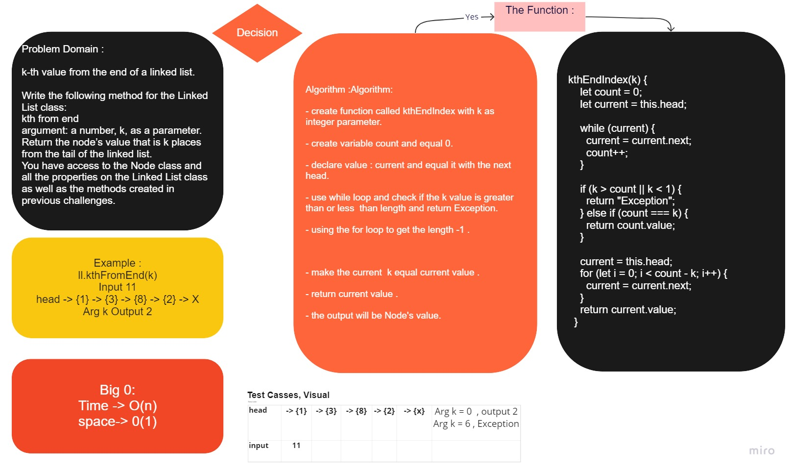

# Read Me File

# Challenge Summary
<!-- Description of the challenge -->
Write a method for the Linked List class which takes a number, k, as a parameter. Return the node’s value that is k from the end of the linked list. You have access to the Node class and all the properties on the Linked List class as well as the methods created in previous challenges.

## Whiteboard Process
<!-- Embedded whiteboard image -->

## Approach & Efficiency
<!-- What approach did you take? Why? What is the Big O space/time for this approach? -->
Understand the problem
Imagined how the results should be
Make a drawings of how the linked list would be after insertion of multiple nodes Linked-List.
Write the code
Create the tests

## Solution
<!-- Show how to run your code, and examples of it in action -->
