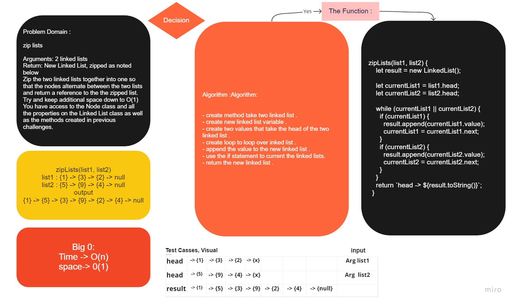

# Read Me File

# Challenge Summary
<!-- Description of the challenge -->
    - Write a function called zip lists
    - Arguments: 2 linked lists
    - Return: New Linked List, zipped as noted below
    - Zip the two linked lists together into one so that the nodes alternate between the two lists and return a reference to the the zipped list.
    - Try and keep additional space down to O(1)
    - You have access to the Node class and all the properties on the Linked List class as well as the methods created in previous challenges.

## Whiteboard Process
<!-- Embedded whiteboard image -->

## Approach & Efficiency
<!-- What approach did you take? Why? What is the Big O space/time for this approach? -->
- Understand the problem
- Imagined how the results should be
- Make a drawings of how the linked list would be after insertion of multiple nodes Linked-List.
- Write the code
- Test the result

## Solution
<!-- Show how to run your code, and examples of it in action -->

    zipLists(list1, list2) {
    let result = new LinkedList();

    let currentList1 = list1.head;
    let currentList2 = list2.head;

    while (currentList1 || currentList2) {
      if (currentList1) {
        result.append(currentList1.value);
        currentList1 = currentList1.next;
      }
      if (currentList2) {
        result.append(currentList2.value);
        currentList2 = currentList2.next;
      }
    }
    return `head -> ${result.toString()}`;
  }
