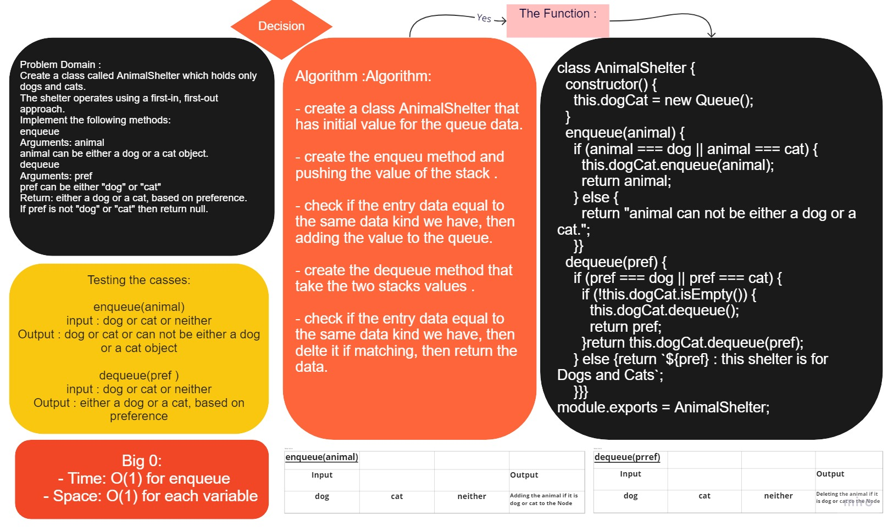

# stack queue Validate Brackets

Create a Stack and Queue classes with some specs

## Challenge

Code Challenge / Algorithm

### Features

Write a function called validate brackets
Arguments: string
Return: boolean
representing whether or not the brackets in the string are balanced
There are 3 types of brackets:

Round Brackets : ()
Square Brackets : []
Curly Brackets : {}

### Queue

- adds a new `node` with that value to the `back` of the queue.
- Removes the `node` from the `front` of the queue.
- Returns the `value` of the `node` located at the `front` of the queue.

#

## Approach & Efficiency

- understand the problem first.
- Imagined how the results should be.
- Write the code.
- Make the tests.

time: O(1)
space: O(1) for each value

#

## API

### Queue

- enqueue(value) : adds a new node with that value to the back of the queue with an O(1) Time performance.

- dequeue() : Removes the node from the front of the queue.

# [Code](../stack-queue-brackets/)

