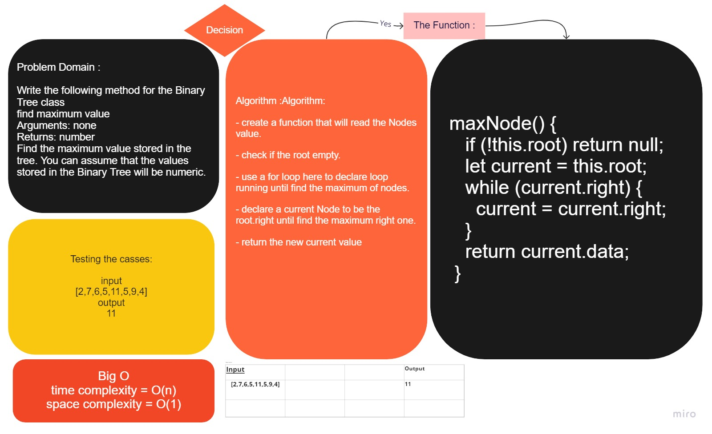
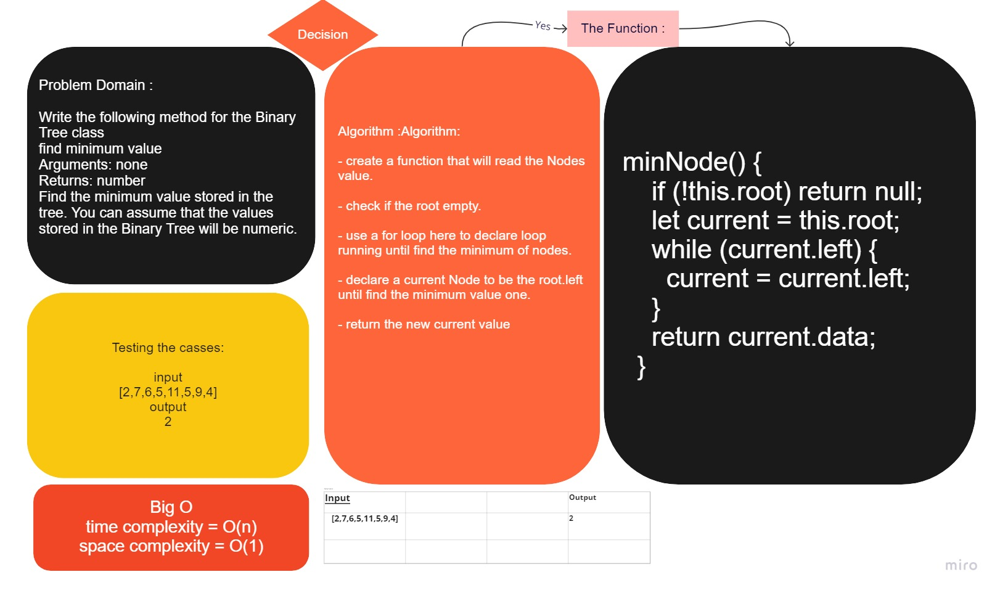

# Binary-Tree

# Trees
<!-- Short summary or background information -->

## Challenge
<!-- Description of the challenge -->
### Node

- Create a Node class that has properties for the value stored in the node, the left child node, and the right child node.

### Binary Tree

- Create a Binary Tree class
  - Define a method for each of the depth first traversals:
    - pre order
    - in order
    - post order which returns an array of the values, ordered appropriately.

### Binary Search Tree

- Create a Binary Search Tree class

  - This class should be a sub-class (or your languages equivalent) of the Binary Tree Class, with the following additional methods:
  - Add
    - Arguments: value
    - Return: nothing
    - Adds a new node with that value in the correct location in the binary search tree.

- Contains
  - Argument: value
  - Returns: boolean indicating whether or not the value is in the tree at least once.

## Approach & Efficiency
<!-- What approach did you take? Why? What is the Big O space/time for this approach? -->

- Understand the problem.

  - Thinking how the results will be.

  - Write the `Tree` on paper after insertion multiple `nodes`.

  - Write the code inside each file for the `Node` and the `Binary Tree`.

  - Making the tests for each file(`Node` , `Binary Tree`) and command.

## API
<!-- Description of each method publicly available in each of your trees -->

- Insert(value): add a value of any type in a new node to the `Tree` in a specific location.
- contain(value): check and compare input value if it is exist in the `Tree` and return `Boolean` result.
- preOrder(): Traverse a tree --> root, left, right.
- inOrder(): Traverse a tree --> left, root, right.
- postOrder(): Traverse a tree --> left, right, root.
- MaxNode(): To have the maximum Node
- minNode(): To have the minimum Node

## [Code](../Binary-Tree/)

### Max

### Min

